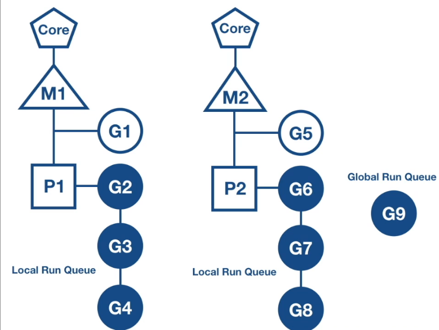
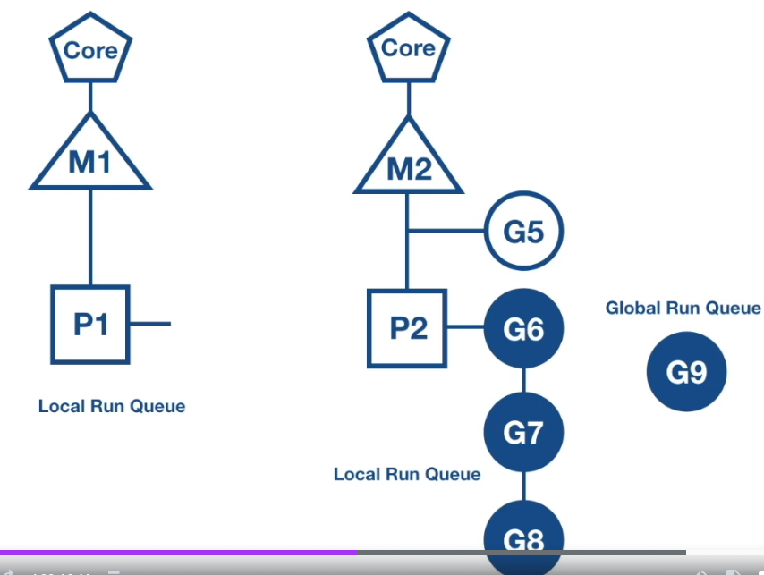
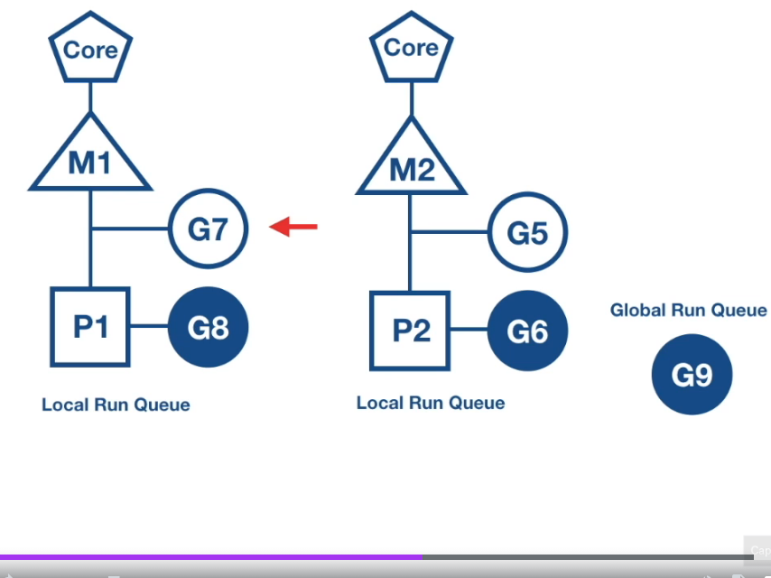
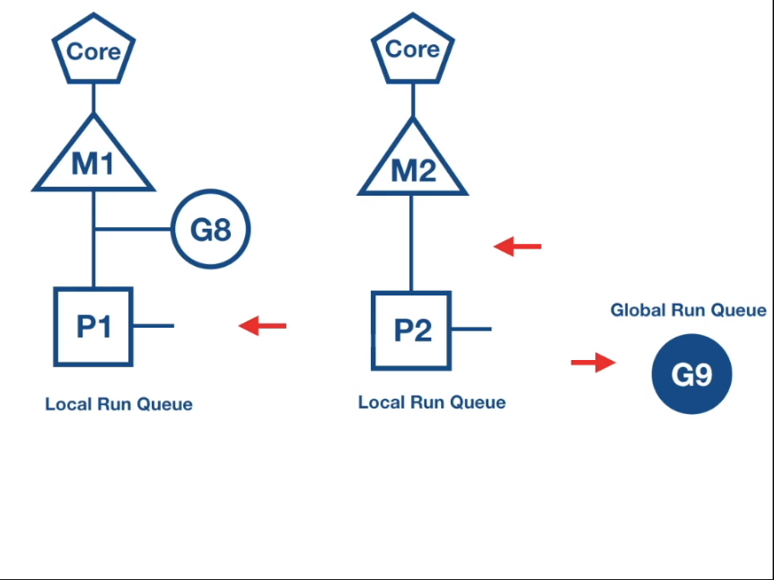

# Go Scheduler

# Work Stealing Algorithm
1. if gor on flow1 suddenly all releases
2. P1 has no gor in local run queue
3. there is gor in runnable state in global run queue
4. P1 try to steal other logical processor 
5. if not found, checkout global run queue for gor
6. if not found, check netpoller

# Pictures

 
initial 

 
gor in flow1 suddenly releases, it will check other p, if not found, checkout global run queue, if not found, check netpoller 

 
in this case, steal half of gor in its local run queue

 
if p2 ran out of gor, p1 has no gor also, then steal G9 in global run queue

