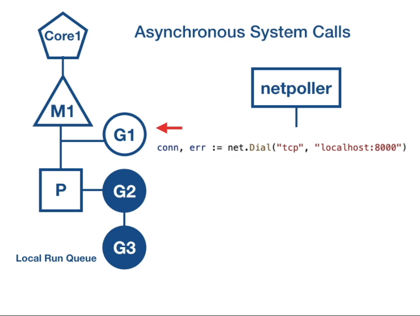
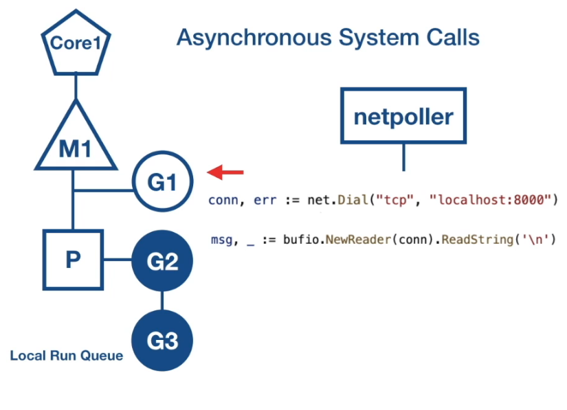
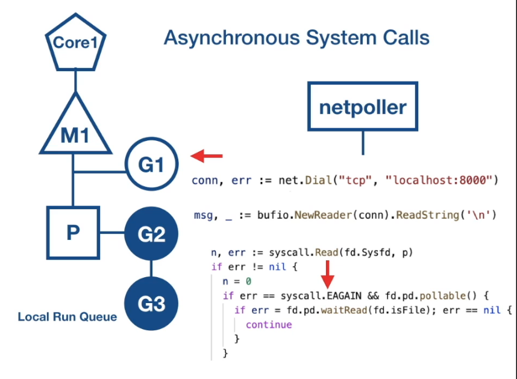
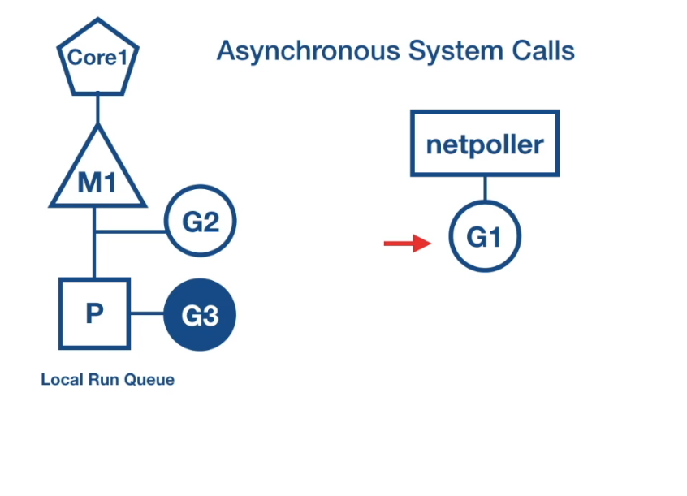
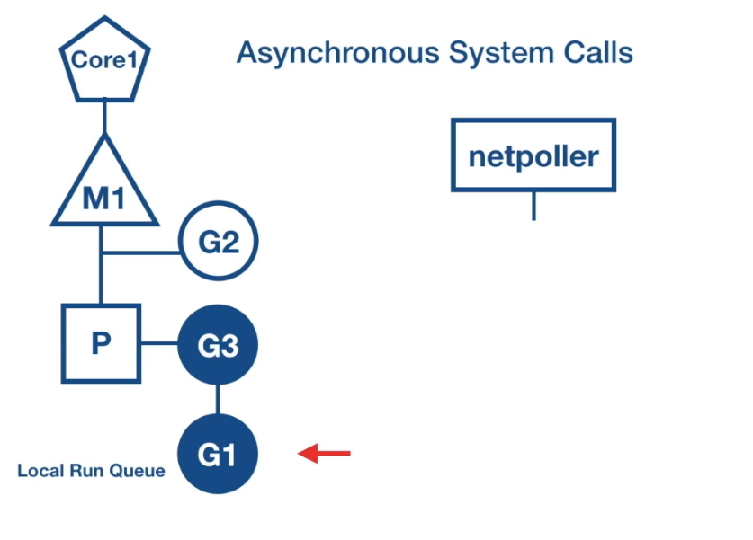

# Async
context switching due to async system call

# Intro
this file introduce the abstraction of asynchronous system call that go deal with:  using  netpoller

# Async Basic
1. system call to set I/O mode to asynchronous
2. need a poller to continue to call the fd
3. if fd is not read, return error
4. poll until fd is ready

# Async Detail
what happen in general when async syscall are made?
1. fd is set to non-blocking mode
2. if fd is not read for I/O operation, syscall does not block, but returns an error
3. AsyncIO mode increase implement complexity
4. Setup event loop using callback function or we have to mantain mapping of fd and function pointer and state to keep track of data read

# Go Solution netpoller 
1. convert async syscall to blocking syscall
2. using epoll(linux) / kqueue(macos) / iocp(windows)

# Flow1: FD is not read
1. when goroutine raise an async syscall and target fd is not ready
2. goroutine parked at netpoller os thread

# Flow2: FD is ready
1. fd(ready) -- notify -->  netpoller -- notify --> goroutine(do I/O)

 
G1 is a server that be connect, and set to nonblocking mode

 
G1 try to read or write to the connection

 
the code will do other operation until it received syscall.EAGAIN

 
then call the netpoller, schedular move G1 to netpoller OS thread, local run queue scheduled, and netpoller use the os interface (like epoll) to poll on the fd, if netpoller received ready notify from os ,then it can perform operation on the fd, then it look through its internal data structure to see if there is illegal routine that are block on the fd, then notifys the go routine, then the gor retry I/O operation

 
when the I/O finish, G1 back to local run queue

SO perform async syscall that no extra OS thread is used (only netpoller thread)

