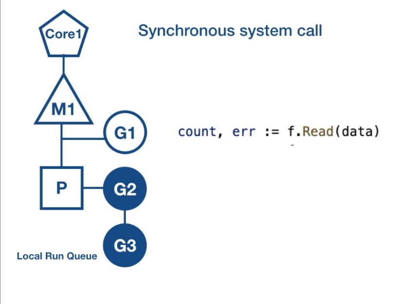
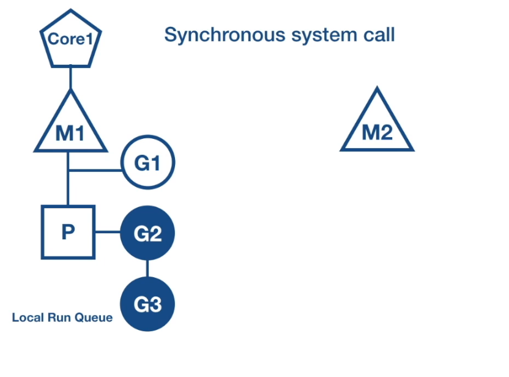
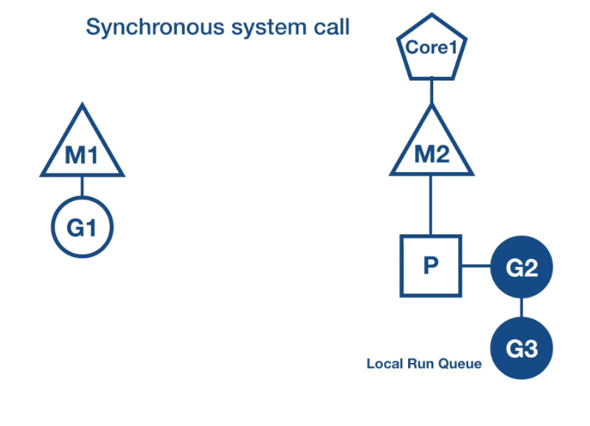
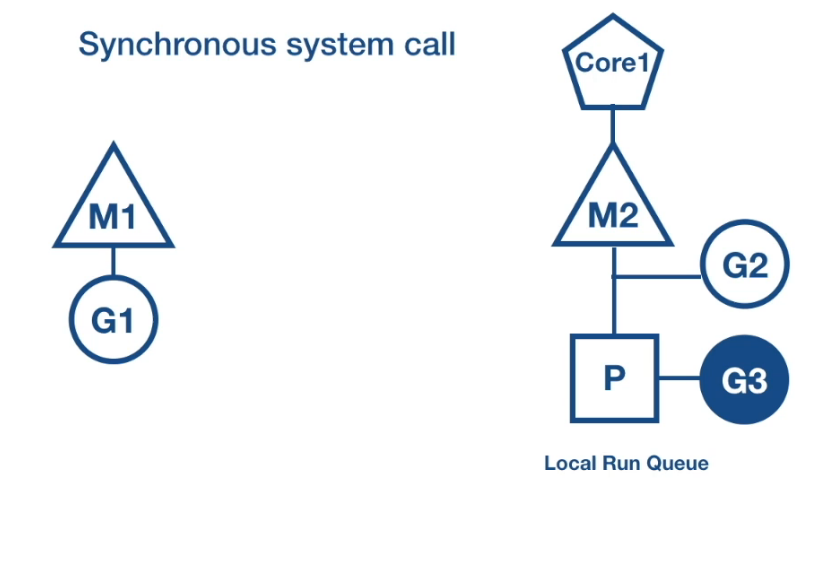
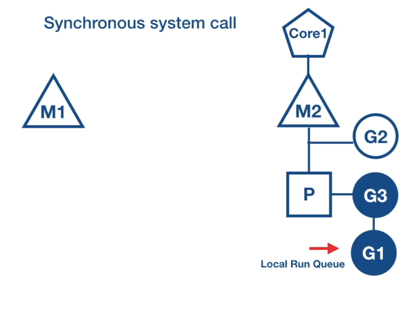

## GPM模型
- GPM 是 golang 在做 goroutine調度時候用的演算法模型
此文做初步介紹

## Pre Information
1. G: goroutine is a user space coroutine
2. P: virtual processor will exists 1
3. M: GO thread

- P will map G(m) and M(n), so there will be m:n mapping

## What will GPM act if sync(blocking) system call ?
1. G1 is in pending state on the current M1 thread, G2 G3 attach to P(local run queue)
2. GoRuntime create a Os thread called M2 
3. GoRuntime atatch P(virtual processor) to M2
4. GoRuntime attach G2 G3 to P (local run queue)
5. G2 attach to M2(execution context)
6. when G1 is complete, attach to P (local run queue)
7. M1 put to sleep, place to local cache

pictures

 

